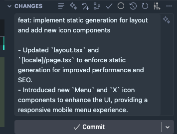

# Cursor IDE Productivity Tips

This repository contains guidelines and best practices for maximizing productivity with Cursor IDE in our development workflow. The goal is to help developers generate high-quality code with fewer iterations by leveraging Cursor's rule-based system and context indexing.

## 🎯 Overview

Cursor IDE can dramatically improve code generation quality when properly configured with:
- **Project-specific rules** (`.cursorrules` file)
- **Agent-specific guidelines** (see `Agents.md`)
- **Proper context indexing** (codebase understanding)

Instead of repeatedly asking the AI to fix code through chat, we can pre-configure rules that guide the AI to generate code that matches our standards from the start.

## 📁 Repository Structure

- **`Agents.md`** - **Single source of truth** containing all comprehensive rules and guidelines for different AI agents and use cases. This is the master document that all projects reference.
- **`.cursorrules`** - Project-level configuration file that links to `Agents.md` and includes project-specific overrides (tech stack, conventions, etc.)
- **`README.md`** - This file, providing overview and setup instructions

## 🚀 Quick Start

### 1. Copy `Agents.md` to Your Repository

```bash
# Copy Agents.md to your company's shared documentation or repository
cp Agents.md /path/to/shared/docs/Agents.md
```

**Note**: `Agents.md` is the single source of truth. Keep it in a central location accessible to all projects.

### 2. Copy `.cursorrules` to Your Project Root

```bash
cp .cursorrules /path/to/your/project/.cursorrules
```

### 3. Update `.cursorrules` for Your Project

Edit `.cursorrules` to:
- Point to the location of `Agents.md` (if not in the same repo)
- Add project-specific tech stack (React, Node.js, Python, etc.)
- Include project-specific conventions and overrides
- Reference your coding standards and architecture patterns

### 4. How It Works Together

- **`Agents.md`** contains all comprehensive rules (API, Frontend, Database, Testing, Security, etc.)
- **`.cursorrules`** links to `Agents.md` and adds project-specific overrides
- Cursor reads `.cursorrules`, which instructs it to follow rules from `Agents.md`
- This allows multiple projects to share the same comprehensive rules while maintaining project-specific customizations

## 💡 Key Benefits

### Before (Without Rules)
- ❌ Multiple chat iterations to fix code style
- ❌ Inconsistent patterns across codebase
- ❌ Missing error handling, tests, documentation
- ❌ Time wasted on refactoring

### After (With Rules)
- ✅ Code generated matches standards on first try
- ✅ Consistent patterns automatically applied
- ✅ Best practices built-in (error handling, tests, docs)
- ✅ Faster development with fewer iterations

## 🔧 How It Works

1. **Context Indexing**: Cursor indexes your codebase to understand project structure
2. **Rule Loading**: `.cursorrules` file is read by Cursor, which references `Agents.md` for comprehensive rules
3. **Rule Application**: Cursor applies rules from `Agents.md` based on the task (API, Frontend, Testing, etc.)
4. **Project Overrides**: Project-specific settings in `.cursorrules` customize the base rules
5. **Code Generation**: AI generates code following the comprehensive rules from `Agents.md` with project-specific adjustments

### Indexing Documents in Cursor

To ensure Cursor has access to your rules and documentation, you can index the `Agents.md` file in Cursor settings:


## 📝 Best Practices

### Writing Effective Rules

1. **Be Specific**: Instead of "write clean code", specify "use TypeScript, prefer functional components, use async/await"
2. **Include Examples**: Show patterns you want to follow
3. **Reference Your Standards**: Link to your style guide, architecture docs
4. **Update Regularly**: As patterns evolve, update rules accordingly

### Rule Categories to Include

- **Language & Framework**: TypeScript, React, Node.js versions
- **Code Style**: Naming conventions, formatting, imports
- **Architecture**: File structure, component patterns, API design
- **Testing**: Test frameworks, coverage requirements, mocking strategies
- **Security**: Authentication, input validation, data sanitization
- **Performance**: Optimization patterns, caching strategies

## 🤝 Contributing

When adding new rules or patterns:

1. **Update `Agents.md`** - This is the single source of truth for all rules
2. Test the rule in a real project scenario
3. Document why the rule is important
4. Provide examples of good vs. bad code
5. Update `.cursorrules` only if adding project-specific overrides

**Important**: Since `Agents.md` is shared across projects, coordinate with your team before making changes that affect all projects.

## 📚 Additional Resources

- [Cursor Documentation](https://docs.cursor.com/)
- [Cursor Rules Guide](https://docs.cursor.com/context/rules)
- Your company's internal coding standards
- Project-specific architecture documentation

## 📸 Example Results

### Commit Message Generation

When using the Commit Message Agent rules, Cursor generates properly formatted commit messages following commitlint conventions:



The Commit Message Agent (defined in `Agents.md`) ensures all commits follow the conventional commits format with proper types, scopes, and subject lines.

## 🎓 Training

For team onboarding:
1. Review this README to understand the structure
2. Study `Agents.md` - This is the comprehensive rulebook for all code generation
3. Examine `.cursorrules` to see how it links to `Agents.md` and adds project-specific overrides
4. Practice with a sample project using both files
5. Share learnings with the team

**Key Point**: `Agents.md` is the master document. `.cursorrules` is a lightweight project-specific configuration that references it.

---

**Remember**: Rules are a starting point. Always review generated code and iterate on rules based on what works best for your team.
